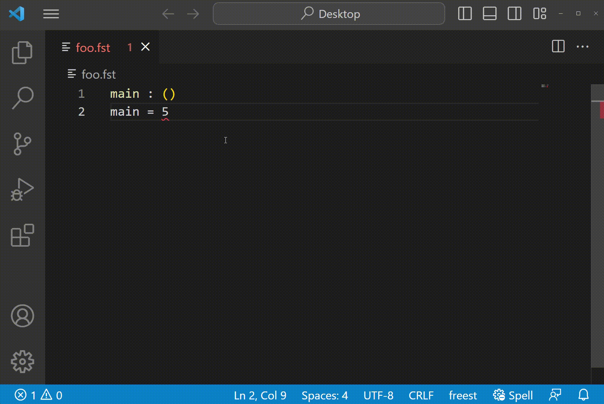
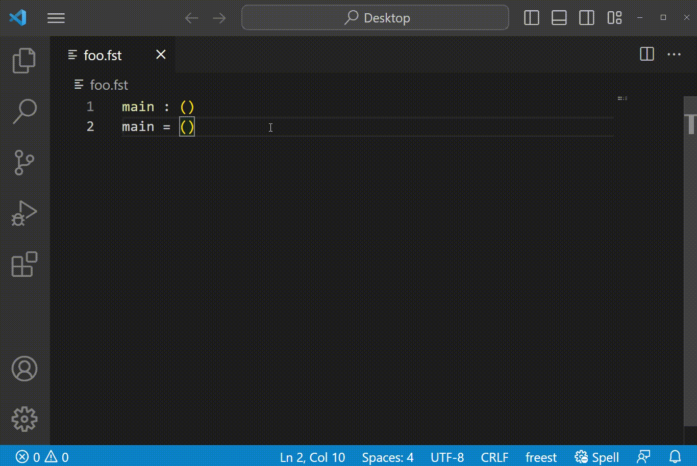

# FreeST Language Server

## Table of Contents
- [Features](#features)
	- [Error highlighting](#error-highlighting)
	- [Run in terminal](#run-in-terminal)
	- [Load into interpreter](#load-into-interpreter)
- [How to install](#how-to-install)
- [Found a bug? Have a new feature in mind?](#found-a-bug-have-a-new-feature-in-mind)

## Features

### Error highlighting
Long gone are the days of switching back and forth between editor and console to locate errors.
	Errors are now highlighted directly on the editor, just hover the highlighted code to 
	see the error message (as given by the compiler).

The extensions verifies files after every file save (not every file change as other extensions
	do).

<!-- Uncomment for cuteness overload -->
<!--  -->

### Run in terminal
Run a FreeST file directly from the editor in VSCode's integrated terminal by right clicking
	it and selecting `FreeST: Run`.

### Load into interpreter
Load a FreeST file directly into FreeST's interpreter (`freesti`) in VSCode's integrated terminal
	by right clicking it and selecting `FreeST: Load into interpreter`.

## How to install
Because the extension depends on the `freestlspserver` executable, independently of your 
installation choice, you will have to install the aformentioned executable by hand.
For this, you can either clone [this](https://github.com/freest-lang/freest-lsp-server) git repository
and follow its instructions, or download and run 
[this](https://github.com/freest-lang/freest-lsp/blob/main/install-lsp-server.sh) script
using `./install-lsp-server`.

## Found a bug? Have a new feature in mind?
If you find any bug, or you have a new idea of a useful feature in mind, feel free to open
	an issue [here](https://github.com/freest-lang/freest-lsp/issues).

For a **bug** issue please include:
- version of the extension
- version of the `freestlspserver` executable
- description of the bug and steps to reproduce (this is important!)
- what you expected to happen (if applicable)

For a **feature** issue please include:
- description of the intended feature (be as descriptive as possible)
- why it is important to have this feature